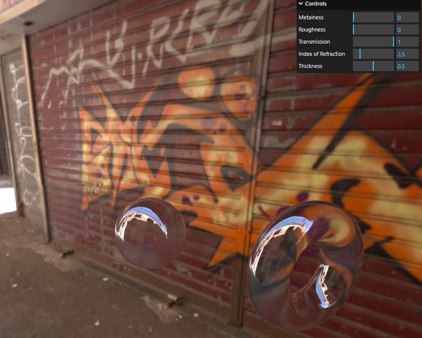

# Environment Maps Test on Three.js

[See this in action](https://threejs-env-maps-apaydev.vercel.app)



This repository contains a 3D scene created with [Three.js](https://threejs.org) in order to experiment a bit with textures, the [MeshBasicMaterial](https://threejs.org/docs/index.html?q=meshba#api/en/materials/MeshBasicMaterial), Environmental Maps and interactive GUIs using [lil-gui](https://lil-gui.georgealways.com).

## How to run it

After cloning the repo, run the following command to install the required dependencies:

```bash
npm i
```

Then, to start the development server, run:

```bash
npm run dev
```

## Notes

Don't use the environment map provided for comercial purposes, since it most likely require a special license.
